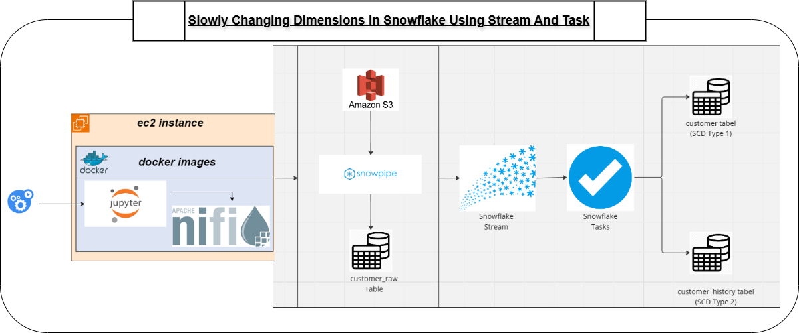

# Slowly Changing Dimensions in Snowflake Using Streams and Tasks

This project demonstrates the implementation of Slowly Changing Dimensions (SCD) in Snowflake using Snowpipe for automated data ingestion, Streams for capturing changes in staging data, and Tasks for processing and applying those changes to target tables.

## Diagram
Below is a visual representation of the pipeline:

## Pipeline Overview
- **Amazon S3**: Stores the incoming data files.
- **Snowpipe**: Loads the data from S3 into Snowflake's staging tables automatically.
- **Snowflake Stream**: Tracks changes (inserts, updates, deletes) in the staging table.
- **Snowflake Tasks**: Automates the transformation and loading of changes into the final dimension tables.

## Key Components
- **S3**: Source for raw data files.
- **Snowpipe**: Automated ingestion mechanism into Snowflake.
- **Streams**: Tracks data changes for SCD implementation.
- **Tasks**: Scheduled jobs for data processing.
- **Snowflake Tables**: Target tables storing the dimension data.

## Use Case
This project is ideal for scenarios where data is continuously updated and Slowly Changing Dimensions (SCD) need to be tracked and managed in a data warehouse environment.

## Technologies Used
- Amazon S3
- Snowflake (Snowpipe, Streams, Tasks)
- Docker
- Apache NiFi
- Jupyter Notebook

## How to Run
1. Clone this repository.
2. Set up your Snowflake environment.
3. Use the provided scripts to configure Snowpipe, Streams, and Tasks.
4. Run the pipeline to observe SCD behavior in Snowflake tables.
